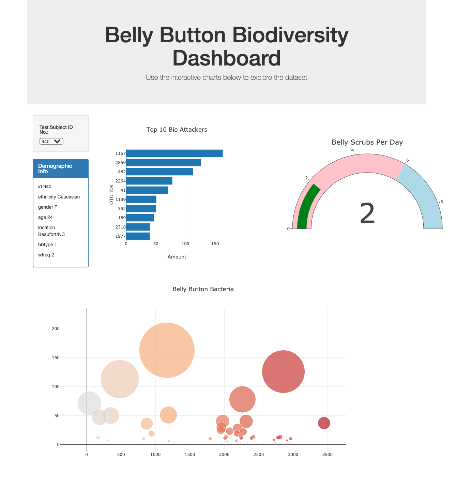

# Plotly/Javascript Skills

## Summary: 
This challenge's task was to build an interactive dashboard to explore the Belly Button Biodiversity dataset, which catalogs the microbes that colonize human navels. It was created with data from a json file into a Javascript file using D3.js. D3 and Plotly charts are connected to the webpage which is styled with CSS and Bootstrap.

http://robdunnlab.com/projects/belly-button-biodiversity/

The dataset reveals that a small handful of microbial species (also called operational taxonomic units, or OTUs, in the study) were present in more than 70% of people, while the rest were relatively rare.

## Final Product: 
https://kasiakalemba.github.io/Plotly-Basic-Skills/

## Skills Displayed: 
* Using Plotly to create basic charts, including bar charts and line charts
* Using Plotly's `layout` object to customize the appearance of their charts
* Annotating charts with labels, text, and hover text
* Manipulating charts through dropdown events and click events.
* Creating charts using data from API calls
* Using `Plotly.restyle()` to create dynamic charts.
* Using switch statements to direct control flow in JavaScript
* Creating advanced dynamic charts, such as candlestick charts
* Creating and deploy custom dashboards.

## Plotly Task 
* Used the D3 library to read in samples.json
* Created a horizontal bar chart with a dropdown menu to display the top 10 OTUs found in that individual
* Created a bubble chart that displays each sample
* Displayed the sample metadata, i.e., an individual's demographic information
* Displayed each key-value pair from the metadata JSON object somewhere on the page.
* Updates all of the plots any time that a new sample is selected
* Adapted the Gauge Chart from https://plot.ly/javascript/gauge-charts/ to plot the weekly washing frequency of the individual

